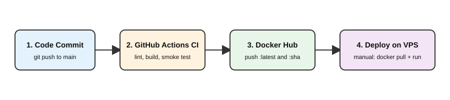
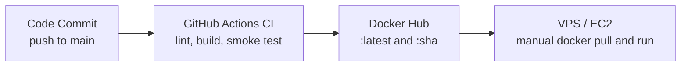

# DevOps Intern Task

Flask app, containerized with Docker, built and pushed by GitHub Actions, plus a Bash health-check script.

## Structure

```
app/main.py              Flask app (GET / -> JSON)
Dockerfile               Multi-stage, non-root, healthcheck
docker-compose.yml       Runs app on port 8080
.github/workflows/ci.yml Lint -> build -> smoke test -> push to Docker Hub
system_health.sh         CPU / memory / disk logger
docs/workflow.svg        Pipeline diagram
```

## Run the app

```bash
docker-compose up --build     # or: docker compose up --build
curl http://localhost:8080/
# {"message":"Hello from DevOps Intern Task!","status":"running"}
```

Stop with `docker-compose down`.

## Run the health script

```bash
chmod +x system_health.sh
./system_health.sh
cat health_log.txt
```

Each run appends a line like `[2026-10-06 14:00:01] CPU: 7% | Memory: 41% | Disk: 63%`.
Disk usage is measured on the root filesystem (`/`). If it is above 80%, it also prints and logs `[WARNING] Disk space high!`.

Run it every 5 minutes with cron: `*/5 * * * * /path/to/system_health.sh`

## CI/CD workflow





CI and image publishing are automated. Deployment to the VPS is a manual step (see the deploy section below), not part of the workflow. Pull requests run lint, build and smoke test only; the Docker Hub push happens only on pushes to `main`.

**Required repo secrets:** `DOCKERHUB_USERNAME`, `DOCKERHUB_TOKEN` (Docker Hub access token).

## How would I deploy this container to AWS (EC2)?

- **Provision:** launch a small EC2 instance (Ubuntu, t3.micro), install Docker, and use a security group that opens only port 80/443 to the world and SSH (22) to my IP only.
- **Deploy:** SSH in (or use GitHub Actions + SSH/SSM as a CD step) and run `docker pull <user>/devops-intern-task:<sha>` then `docker run -d --restart unless-stopped -p 80:8080 ...`. Pinning the commit SHA tag makes rollbacks trivial.
- **Harden and scale later:** put Nginx or an ALB in front for HTTPS, give the instance an IAM role instead of static keys, ship logs to CloudWatch, and move to ECS Fargate if I need autoscaling.
